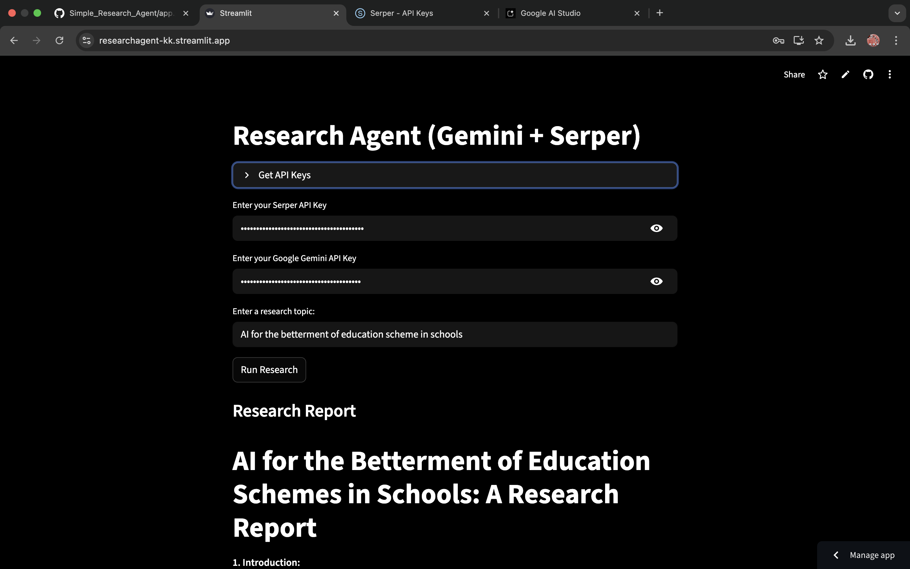
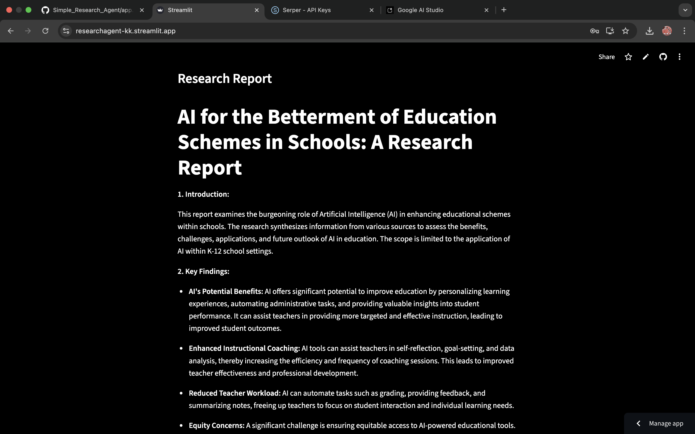
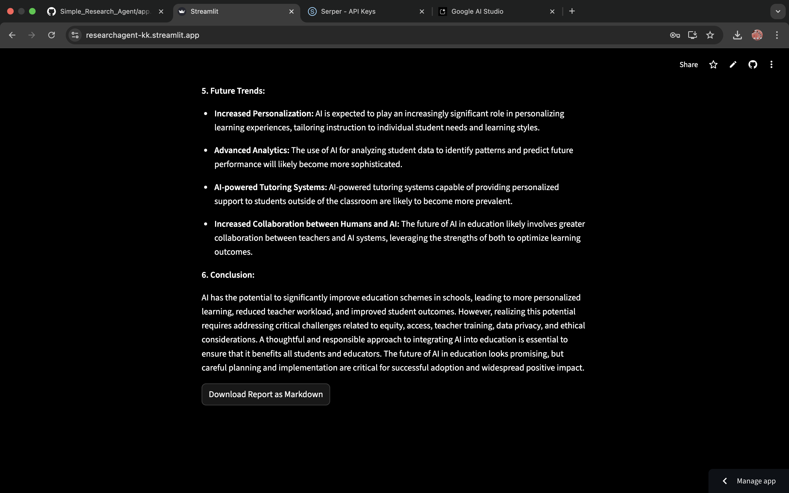
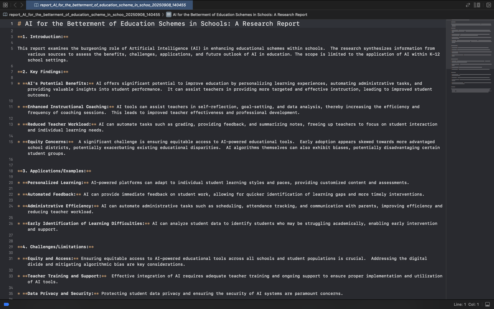

# Simple Research Agent

This project is a Streamlit web application that acts as a research assistant. It uses Google's Gemini model to conduct research on a given topic, synthesizes the findings, and generates a comprehensive report in Markdown format.

[](https://researchagent-kk.streamlit.app/)

## Demo

Here's a walkthrough of the application:

1.  **Enter API Keys and Topic:**
    Provide your Serper and Google Gemini API keys, along with the research topic.
    

2.  **Run Research:**
    The agent conducts searches and generates the report.
    

3.  **View Report:**
    The generated report is displayed directly in the app.
    

4.  **Download Report:**
    You can download the report as a Markdown file.
    

## Tech Stack

-   **Frontend:** [Streamlit](https://streamlit.io/)
-   **Language Model:** [Google Gemini](https://ai.google.dev/)
-   **Search:** [Serper](https://serper.dev/) for Google Search results
-   **Core Logic:** [CrewAI](https://www.crewai.com/)
-   **Language:** Python

## Cloning and Running Locally

To run this project on your local machine, follow these steps:

1.  **Clone the repository:**
    ```bash
    git clone https://github.com/CodebyKumar/Simple_Research_Agent.git
    cd Simple_Research_Agent
    ```

2.  **Install dependencies:**
    It's recommended to use a virtual environment.
    ```bash
    python -m venv venv
    source venv/bin/activate  # On Windows, use `venv\Scripts\activate`
    pip install -r requirements.txt
    ```

3.  **Set up environment variables:**
    Create a `.env` file in the root of the project and add your API keys:
    ```
    SERPER_API_KEY="your_serper_api_key"
    GOOGLE_API_KEY="your_google_api_key"
    ```

4.  **Run the Streamlit app:**
    ```bash
    streamlit run app.py
    ```

## Deployment

This application is deployed on Streamlit Cloud and is available here:
[https://researchagent-kk.streamlit.app/](https://researchagent-kk.streamlit.app/)


A simple research automation tool that uses web search and Google Gemini to generate comprehensive research reports on any topic.

## Features
- Automated web search using Serper API
- AI-powered report generation using Google Gemini
- Markdown report output, ready for sharing or publishing
- Clean, modular Python codebase

## Requirements
- Python 3.8+
- [Serper API key](https://serper.dev/)
- [Google Gemini API key](https://ai.google.dev/)
- Install dependencies:

```sh
pip install -r requirements.txt
```

## Setup
1. Clone this repository.
2. Create a `.env` file in the project root with the following content:
   ```env
   SERPER_API_KEY=your_serper_api_key_here
   GOOGLE_API_KEY=your_google_gemini_api_key_here
   ```
3. (Optional) Create a `reports/` directory, or let the script create it automatically.

## Usage
Run the research agent from the command line:

```sh
python main.py "Your research topic here"
```

### Example
```sh
python main.py "The Impact of Artificial Intelligence on the Future of Work"
```

The generated report will be saved in the `reports/` directory as a Markdown file.

## Output
- The report is saved as a clean Markdown file (no code block markers).
- Example output file: `reports/research_report_The_Impact_of_Artificial_Intelligence_on_the_Futur_20250614_222627.md`

## Project Structure
```
main.py
requirements.txt
reports/
utils/
    agent.py
    gemini_agent.py
    serper_api.py
    helpers.py
```

## Notes
- Make sure your API keys are valid and have sufficient quota.
- The tool does not log or save any information except the generated report.
- If you encounter issues, check your `.env` file and API key validity.

## License
MIT License


